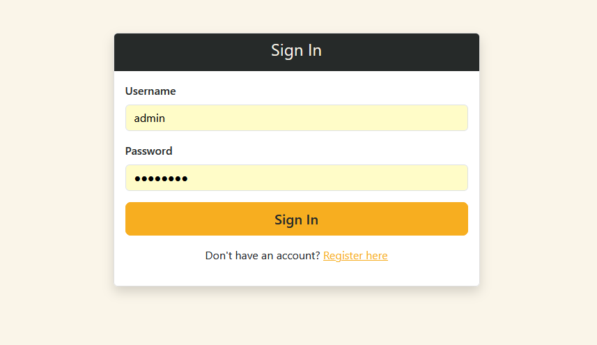
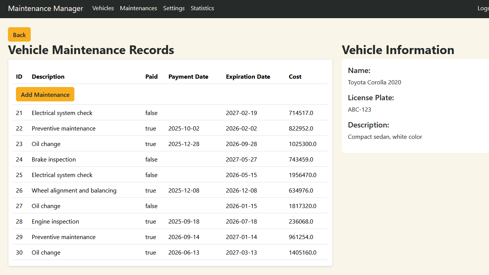
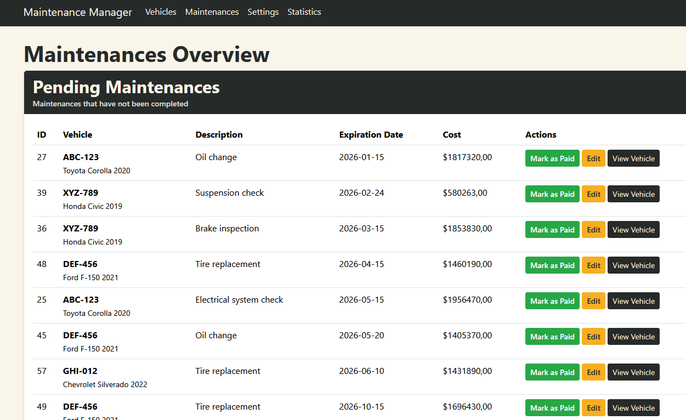
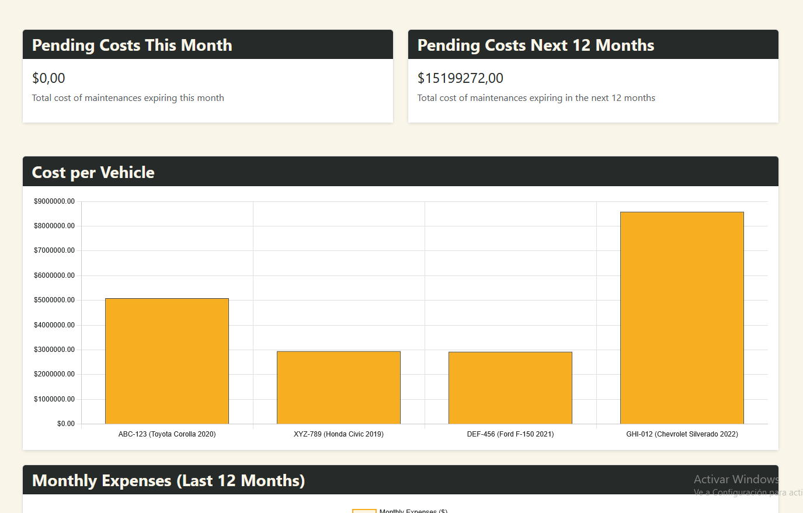
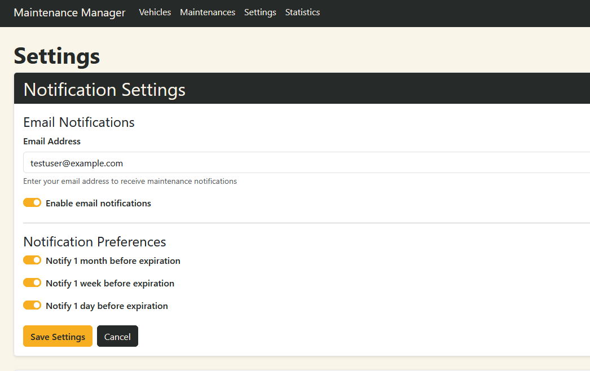

# Vehicle Maintenance Management System

A comprehensive web application for managing vehicle maintenance records, built with Spring. This system allows users to track essential vehicle maintenance tasks including oil changes, technical inspections, and SOAT (insurance) renewals.

## Features

### User Management
- User registration and authentication
- Secure login system with Spring Security
- User profile management and settings

### Vehicle Management
- Complete vehicle inventory management
- Add, edit, and delete vehicles
- View detailed vehicle information
- Track multiple vehicles per user

### Maintenance Tracking
- Record maintenance operations (oil changes, technical inspections, SOAT)
- Set expiration dates for each maintenance
- Mark maintenance as paid/unpaid
- View all maintenances in a unified overview
- Automatic notifications for upcoming expirations

### Statistics and Analytics
- Total vehicles count
- Pending and completed maintenances statistics
- Cost per vehicle comparison charts
- Total costs overview
- Pending costs for current month
- Pending costs forecast for next 12 months
- Monthly expenses timeline (last 12 months)
- Quarterly summary reports

### Notifications
- Email notifications for upcoming maintenance expirations
- Scheduled notification service
- Configurable notification settings

## Technology Stack

- **Framework**: Spring 3.5.6
- **Database**: JPA/Hibernate with H2 Database (or your preferred database)
- **Security**: Spring Security
- **Frontend**: Thymeleaf templates with Bootstrap
- **Charts**: Chart.js for data visualization
- **Java Version**: 21

## Project Structure

```
src/main/java/com/portafolio/mantenimiento_vehiculos/
├── config/              # Configuration classes (Security, Data initialization)
├── controller/          # REST controllers
├── interfaces/          # Repository interfaces
├── model/               # Entity models and DTOs
├── service/             # Business logic services
└── MantenimientoVehiculosApplication.java
```

## Screenshots

### Login Page


### Vehicle Inventory


### Vehicle Details


### Maintenance Overview


### Statistics Dashboard


### Settings


## Getting Started

### Prerequisites

- Java 21 or higher
- Maven 3.6 or higher
- Your preferred IDE (IntelliJ IDEA, Eclipse, VS Code)

### Installation

1. Clone the repository:
```bash
git clone https://github.com/andrexocampo/mantenimiento-vehiculos.git
cd mantenimiento-vehiculos
```

2. Build the project:
```bash
mvn clean install
```

3. Run the application:
```bash
mvn spring-boot:run
```

4. Access the application:
   - Open your browser and navigate to `http://localhost:8080`
   - Register a new user or use the test credentials (if available)

## Configuration

### Database Configuration

The application uses H2 in-memory database by default. To use a different database, update `src/main/resources/application.properties`:

```properties
spring.datasource.url=jdbc:mysql://localhost:3306/your_database
spring.datasource.username=your_username
spring.datasource.password=your_password
spring.jpa.hibernate.ddl-auto=update
```

### Email Configuration

To enable email notifications, configure your SMTP settings in `application.properties`:

```properties
spring.mail.host=smtp.gmail.com
spring.mail.port=587
spring.mail.username=your_email@gmail.com
spring.mail.password=your_app_password
spring.mail.properties.mail.smtp.auth=true
spring.mail.properties.mail.smtp.starttls.enable=true
```

## Usage

1. **Register/Login**: Create an account or log in with existing credentials
2. **Add Vehicles**: Navigate to Vehicle Inventory and add your vehicles
3. **Record Maintenance**: For each vehicle, add maintenance records with expiration dates
4. **Monitor**: Use the Statistics page to monitor costs and upcoming expirations
5. **Configure**: Adjust notification settings in the Settings page

## API Endpoints

The application provides RESTful endpoints for:
- Vehicle CRUD operations
- Maintenance CRUD operations
- User management
- Statistics retrieval
- Authentication

## Contributing

Contributions are welcome. Please feel free to submit a Pull Request.

## License

This project is licensed under the MIT License - see the LICENSE file for details.

## Author

Andres Ocampo

## Acknowledgments

- Spring community
- Bootstrap for UI components
- Chart.js for data visualization
